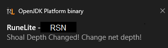
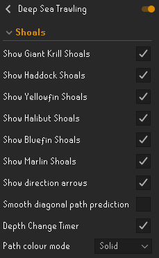
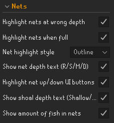
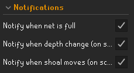
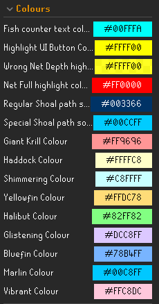

# Deep Sea Trawling Plugin
The Deep Sea Trawling plugin is a RuneLite plugin that helps make the Deep Sea Trawling Sailing activity in Old School Runescape easier by helping to track all different kinds of fish shoals and their depths.

**Features:**
- **Shoal paths:** A line is drawn along the exact path that each shoal travels with arrows pointing the direction the shoal is moving. A box is drawn at each shoal stopping point.\

- **Shoal tagging:** Tags each shoal with a coloured square. Colour changes depending on which kind of shoal it is. Colours can be changed in the config.\

- **Depth indicator:** A small indicator attached to each shoal shows what depth the shoal is currently at (Either "Shallow", "Medium" or "Deep"). Highlights your nets yellow if the depth is at a different depth to the shoals current depth.\

- **Depth UI highlighting:** Highlights the buttons to raise/lower your trawling nets if they need to be raised/lowered.\

- **Shimmering, glistening and vibrant shoals:** Changes the colours of paths and the tags of the shoals when they become either shimmering, glistening or vibrant. These colours can be changed in the config.\

- **Fish quantity info box:** An info box is displayed on the screen that shows how many fish are currently in your nets. Highlights your nets red when your nets are at full capacity. Text colour can be changed in the config.\

- **Depth change timer:** A box is displayed above each shoal that indicates how much time (in seconds) is left until it both changes depth and continues moving.\

- **Net depth UI text:** A rounded box is drawn over top of the trawling net icon displaying either R, S, M or D (Raised, Shallow, Medium or Deep).\

- **Gradient path colour mode:** The option to change the paths from a solid color to a rainbow gradient.\

- **Notifications:** Windows notifications if you're not tabbed in to the game for when the net changes depth, starts moving and when the nets are full.\

# Configuration
- **Shoal config:** Config settings for the shoals:
  - Toggle each different kind of shoal
  - Toggle the directional arrows
  - Toggle the path smoothing
  - Toggle depth change timer
  - Change colour mode (Solid and Gradient)\

- **Nets config:** Config settings for your nets:
  - Toggle highlighting nets at wrong depth
  - Toggle highlighting for when your nets are full
  - Change net highlight style (Outline, Hull Fill or Clickbox)
  - Toggle the rounded net depth text in the UI
  - Toggle highlighting the UI buttons for raising/lowering your nets when they are at incorrect depth
  - Toggle the text box above each shoal that shows which depth it is currently at
  - Toggle for the info box that displays how many fish you have in your nets\

- **Notification config:** Config settings for the notifications:
  - Notification toggle for when your nets are full
  - Notification toggle for when the depth changes
  - Notification toggle for when the shoal starts moving\

- **Colour config:** Config settings for all the colours you can change within the plugin:
  - Info box fish counter colour
  - Net highlighting colour
  - Net full highlighting colour
  - Regular and special path colours
  - All the kinds of fish tagging colours\
